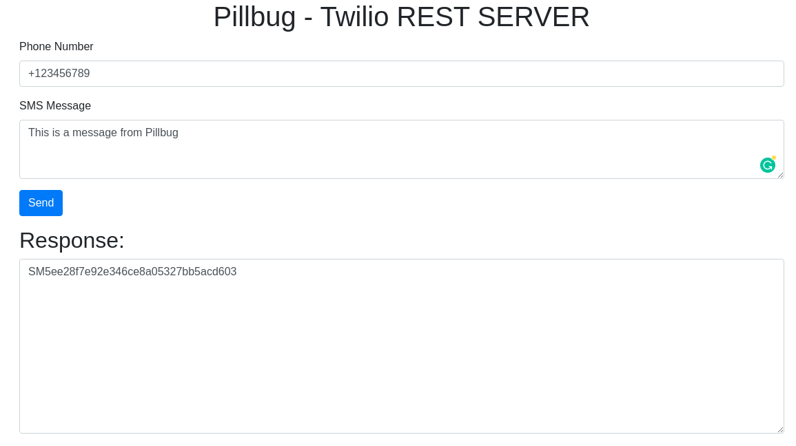

## Table of Contents
<!-- ⛔️ MD-MAGIC-EXAMPLE:START (TOC:collapse=true&collapseText=Click to expand) -->
<details>
<summary>Click to expand</summary>

1. [Introduction](#1-introduction)
2. [Setup](#2-setup)
3. [Authors](#3-authors)
4. [License](#4-license)
5. [References](#5-references)

</details>
<!-- ⛔️ MD-MAGIC-EXAMPLE:END -->


## 1 Introduction

This is the official Twilio REST Server for Pillbug.

Example of Usage: 
```bash
curl -d '{"message":"YOUR MESSEGE", "phone_number":"PHONENUMBER"}' -H "Content-Type: application/json" -X POST http://localhost:5000/send
```


Offers a Web GUI on port http://localhost:5000/

## 2 Setup

Make sure to have Python 3.6 or newer installed.

### 2.1 Get virtualenv

```bash
$ pip3 install virtualenv
```

### 2.2 Create a virtual enviroment

Make sure to create a Python3 instead of Python2 enviroment by refrencing its binaries.
```bash
$ which python3
/usr/bin/python3
```

You can use any name you want, we will use "venv".
```bash
$ virtualenv -p /usr/bin/python3  venv
```

### 2.3 Activate enviroment

```bash
$ . venv/bin/activate
```

Now you have activated your virual enviroment and your teminal should display its name as so:
```bash
$(venv)
```

### 2.4 Install requried packages
```bash
$(venv) pip3 install -r requirements.txt  
```

### 2.5 Set Enviroment Variables
```bash
export TWILIO_ACCOUNT_SID="<your account sid>"
export TWILIO_AUTH_TOKEN="<your auth token>"
```

### 2.6 Run The Application

```bash
$(venv) python3 server.py
```

You’ll see output similar to this:

```bash
Serving Flask app "server"
Environment: development
Debug mode: on
Running on http://127.0.0.1:5000/ (Press CTRL+C to quit)
```

## 3 Authors
* [Egill Anton Hlöðversson](https://github.com/egillanton)
* [Enes Tasbasi](https://github.com/etasbasi)
* [Aliyah Desautels](https://github.com/itsnotaliyah)

## 4 License
This project is licensed under the MIT License - see the [LICENSE](LICENSE) file for details.

## 5 References
* [Twilio Python API](https://www.twilio.com/docs/sms/quickstart/python#install-python-and-the-twilio-helper-library

<p align="center">
🌟 PLEASE STAR THIS REPO IF YOU FOUND SOMETHING INTERESTING 🌟
</p>